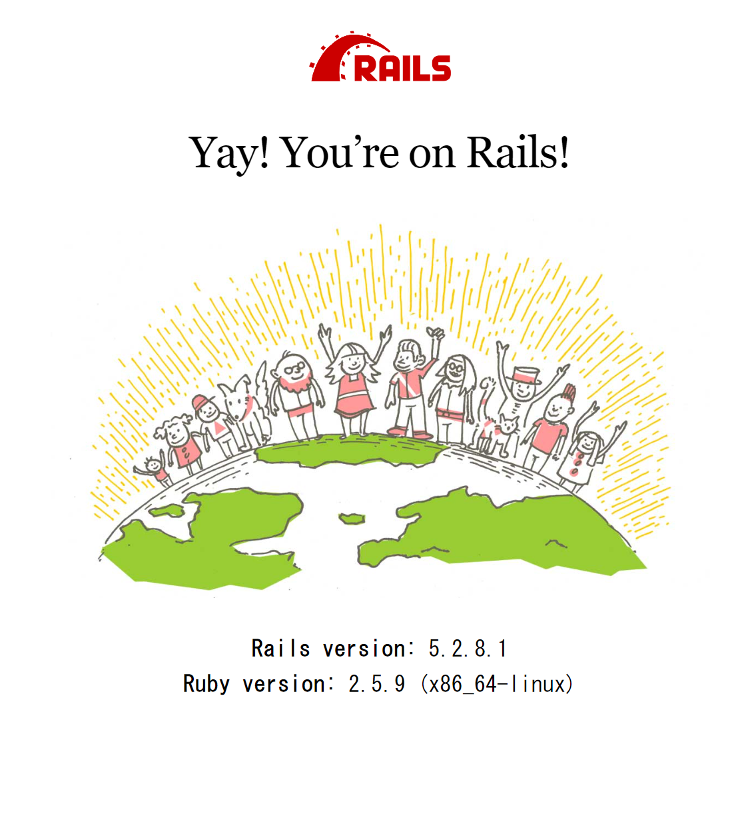
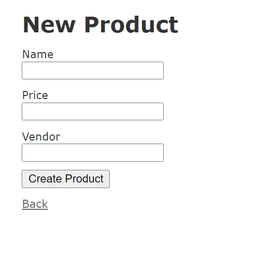

# README

- [米国AI開発者がゼロから教えるDocker講座](https://www.udemy.com/course/aidocker/)の応用編第二弾(part1)で作成したruby開発用コンテナを起動するためのdocker構成

# 手順

## 任意の配下に'git clone'
```
git clone https://github.com/takuya-tokumoto/product-register.git
```

## docker-composeでコンテナを起動
```
cd product-register
docker-compose build
docker-compose up -d #デタッチモードでコンテナ起動
docker-compose exec web bash
```

## コンテナ内でrailsを起動
```
rails db:create
#rails g scaffold product name:string price:integer vendor:string
rails db:migrate
rails s -b 0.0.0.0
```

## 作成物を確認
- ローカルPCからrailsを起動した場合、ブラウザから`localhost:3000`で確認可能
- topページが表示されたら成功
- `~/products`に遷移することでデータをためる機能を確認できる


